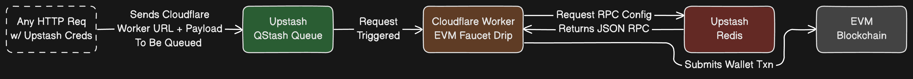

# Cloudflare EVM Faucet

A generic Cloudflare Worker (edge function) that handles distributing gas or specific tokens for EVM chains as Testnet Faucet.



## Requirements

- NVM or NodeJS `v20.14.0` or greater
- [Cloudflare Worker](https://workers.cloudflare.com) account
- [Upstash Redis](https://upstash.com/docs/redis/overall/getstarted) account
- [Upstash Qstash](https://upstash.com/docs/qstash/overall/getstarted) account

## Setup

### 1 - Environment Variables

Start by making a copy of the `.dev.vars.example` file.

```bash
# FROM: ./

cp .dev.vars.example .dev.vars;
```

Fill in the information needed:

**File:** `./.dev.vars`

```bash
UPSTASH_REDIS_REST_URL="https://<YOUR_UPSTASH_URL>.upstash.io"
UPSTASH_REDIS_REST_TOKEN="<YOUR_UPSTASH_REST_TOKEN>"
UPSTASH_QSTASH_TOKEN="<YOUR_UPSTASH_QSTASH_TOKEN>"
QSTASH_QUEUE="<YOUR_QSTASH_QUEUE_NAME>"
QSTASH_CURRENT_SIGNING_KEY="<YOUR_QSTASH_CURRENT_SIGNING_KEY>"
QSTASH_NEXT_SIGNING_KEY="<YOUR_QSTASH_NEXT_SIGNING_KEY>"
RPC_CHAIN_ID="<YOUR_CHAIN_ID>"
RPC_CHAIN_NAME="<YOUR_RPC_CHAIN_NAME>"
RPC_URL="<YOUR_RPC_URL>"
RPC_TOKEN_SYMBOL="<YOUR_RPC_TOKEN_SYMBOL>"
RPC_TOKEN_DECIMALS="<YOUR_RPC_TOKEN_DECIMALS>"
RPC_BLOCKEXPLORER_URL="<YOUR_RPC_BLOCKEXPLORER_URL>"
WALLET_PRIVATE_KEY="<YOUR_FAUCET_WALLET_PRIVATE_KEY>"
```

### 2 - Redis Configuration

For the redis configuration, you will need to configure an `rpc` value and optionally a `token` key value.

To store the RPC values into redis, run the following:

```bash
# FROM: ./

pnpm redis:rpc;
```

To add a unique token, run the following:

```bash
# FROM: ./

# SYMBOL: honey (without $)
# TOKEN ADDRESS: 0x..
# DECIMALS: 18
pnpm redis:token honey 0x0E4aaF1351de4c0264C5c7056Ef3777b41BD8e03 18
```

### 3 - Running Locally

Running locally will run the script on port http://localhost:8787.
In order to for a success transaction, a proxy that exposes this port publicly will need to be run in order for Upstash Qstash to successfully trigger the worker.

**Terminal 1**

Start by running a local development instance:

```bash
# FROM: ./

pnpm dev;
```

**Terminal 2**

Once the development environment is running, run a local tunnel to that port:

```bash
# FROM: ./

pnpm lt;

# [Expected Equivalent Output]:
# your url is: https://thick-dogs-drop.loca.lt
```

Go to [https://loca.lt/mytunnelpassword](https://loca.lt/mytunnelpassword) and copy the value there.

Then visit your local tunnel, (Example: https://thick-dogs-drop.loca.lt) and paste the value into the `Tunnel Password` field.

**Terminal 3**

```bash
# FROM: ./

source .dev.vars && curl --location "https://qstash.upstash.io/v2/enqueue/$QSTASH_QUEUE/https://thick-dogs-drop.loca.lt" \
--header "Authorization: Bearer $UPSTASH_QSTASH_TOKEN" \
--header 'Content-Type: application/json' \
--header 'Upstash-Retries: 0' \
--data '{ "address": "0xB3f03B93F0bd65B960EE950d9aFC6867D461C33f", "token": "$bera", "amount": "1"}'

# [Expected Output]:
# {"messageId":"msg_24hZCxZCuWyyTWpmSVBrNCtiJFKopJ2Jk5cEMChhes54U2KYGHCp2QzZDMJJbR1"}
```

If successful, you will see the following in **Terminal 1**:

```bash
# [wrangler:inf] POST / 200 OK (5093ms)
# Transaction Hash: https://bartio.beratrail.io/tx/0x79b818d7cf6030b373de47d3a236c3446c5cd7a0d1caaa3598b8a7e312e9032e
```

## Deployment

To get the script deployed on cloudflare, run the following steps.

### 1 - Wrangler Publish

> NOTE: You will need to be authenticated with Cloudflare for this step.

```bash
# FROM: ./

# Use this command whenever you update your script
pnpm run deploy;

# [Expected Output]:
# > cloudflare-evm-faucet@0.0.0 deploy /path/to/cloudflare-evm-faucet
# > wrangler publish
#
#  ⛅️ wrangler 3.72.3
# -------------------
#
# ▲ [WARNING] `wrangler publish` is deprecated and will be removed in the next major version.
#
#   Please use `wrangler deploy` instead, which accepts exactly the same arguments.
#
# Total Upload: 992.03 KiB / gzip: 219.05 KiB
# Worker Startup Time: 21 ms
# Uploaded cloudflare-evm-faucet (3.90 sec)
# Published cloudflare-evm-faucet (3.90 sec)
#   https://cloudflare-evm-faucet.<YOUR_CLOUDFLARE_URL>.workers.dev
# Current Deployment ID: <YOUR_CLOUDFLARE_DEPLOYMENT_ID>
# Current Version ID: <YOUR_CLOUDFLARE_DEPLOYMENT_ID>
#
# Note: Deployment ID has been renamed to Version ID. Deployment ID is present to maintain compatibility with the previous behavior of this command. This output will change in a future version of Wrangler. To learn more visit: https://developers.cloudflare.com/workers/configuration/versions-and-deployments
```

### 2 - Wrangler Variables

With the Cloudflare worker deployed, we need to set all variables.

For every `UPSTASH_` and `QSTASH_` values in `./.dev.vars`, run the following:

```bash
# FROM: ./

pnpm dlx wrangler secret put UPSTASH_REDIS_REST_URL;

# [Expected Prompt]:
#  ⛅️ wrangler 3.72.3
# -------------------
#
# ? Enter a secret value: › ***********************************
# 🌀 Creating the secret for the Worker "cloudflare-evm-faucet"
# ✨ Success! Uploaded secret UPSTASH_REDIS_REST_URL
```

### 3 - Test Cloudflare Worker

With the deployment done, and environment variables set, test the script.

```bash
# FROM: ./

# Don't forget to replace <YOUR_CLOUDFLARE_URL>
source .dev.vars && curl --location "https://qstash.upstash.io/v2/enqueue/$QSTASH_QUEUE/https://cloudflare-evm-faucet.<YOUR_CLOUDFLARE_URL>.workers.dev" \
--header "Authorization: Bearer $UPSTASH_QSTASH_TOKEN" \
--header 'Content-Type: application/json' \
--header 'Upstash-Retries: 0' \
--data '{ "address": "0xB3f03B93F0bd65B960EE950d9aFC6867D461C33f", "token": "$bera", "amount": "2"}';

# [Expected Equivalent Output]:
# {"messageId":"msg_26hZCxZCuWyyTWPmSVBrNCtiJFrtf57i82gBjFRWhhnzzzJwyUi9q2jnB2mrDy3"}
```

Now if you visity your QStash events at [https://console.upstash.com/qstash?tab=events](https://console.upstash.com/qstash?tab=events), you'll see if the event was triggered correctly or not and you should be able to visit the block explorer with your address to verify the transaction as well.
